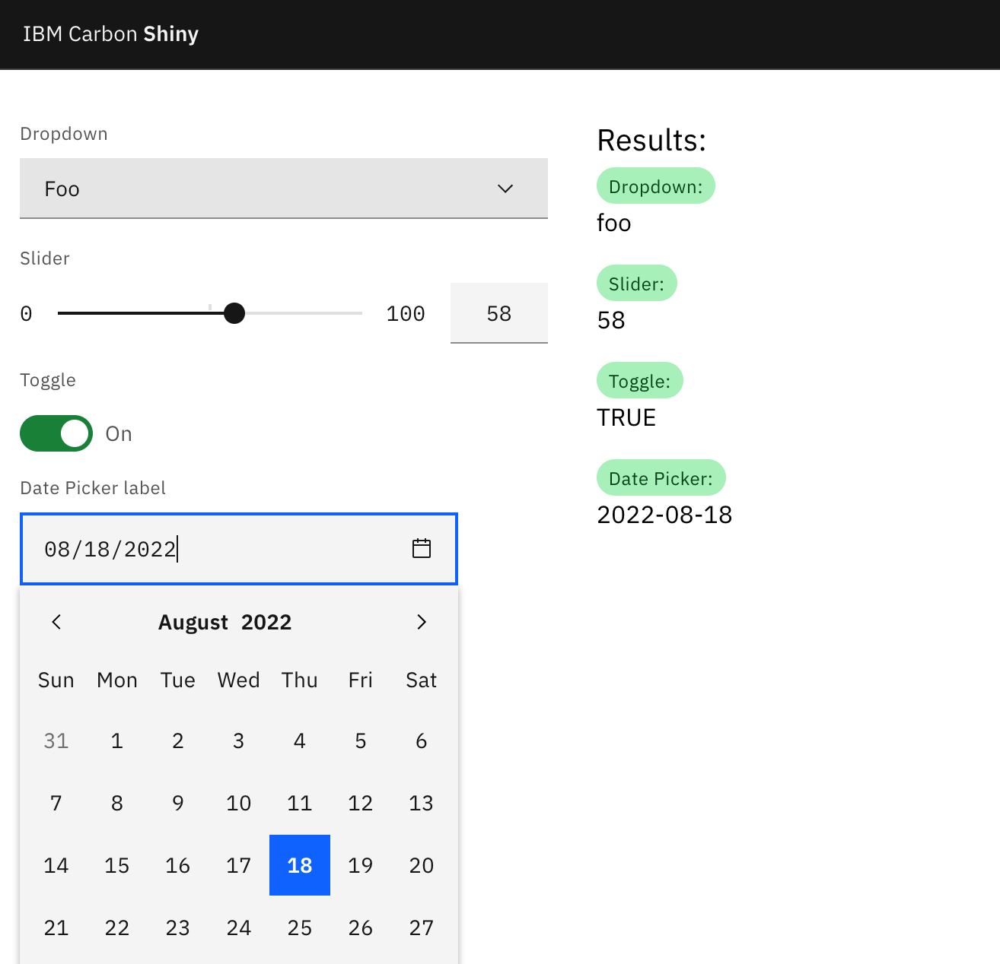

# [Shiny](https://shiny.rstudio.com/) with [Carbon Design System](https://carbondesignsystem.com/)

> Carbon is IBM’s **open source** design system for products and digital experiences. With the IBM Design Language as its foundation, the system consists of working code, design tools and resources, human interface guidelines, and a vibrant community of contributors.

## Using with shiny

Set the dependency to each component with `htmltools::htmlDependency`:

```
dep_toggle <- htmltools::htmlDependency(
    name = "toggle",
    version = "1.0.0",
    src = list(href = "https://1.www.s81c.com/common"),
    script = list(type = "module", src = "carbon/web-components/tag/latest/toggle.min.js"),
    stylesheet = list(href = "carbon-for-ibm-dotcom/tag/v1/latest/plex.css")
)
```

Set the components with the `tags`:

```
toggle <- htmltools::tag("bx-toggle", 
                         list(id = "toggle",
                              `checked-text` = "On",
                              `label-text` = "Toggle",
                              `unchecked-text` = "Off"))
```

Output in the `ui` with `htmltools::attachDependencies(toggle, dep_toggle)`.

To process the input:

```
tags$script(HTML('document.getElementById("toggle").addEventListener("bx-toggle-changed", (e) => {Shiny.setInputValue("toggle", e.target.__checked)});'))
```

The `toggle` in `Shiny.setInputValue("toggle", e.target.__checked)` is the id to use with `input$toggle` in the `server` side. The `e.target.__checked` is the value of event executed by component.

## Example

{width=70%}

## References

- [Storybook with components](https://web-components.carbondesignsystem.com/)
- [Carbon Grid](https://github.com/carbon-design-system/carbon/tree/v10/packages/grid)
